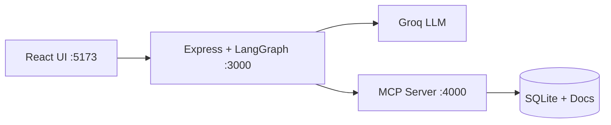
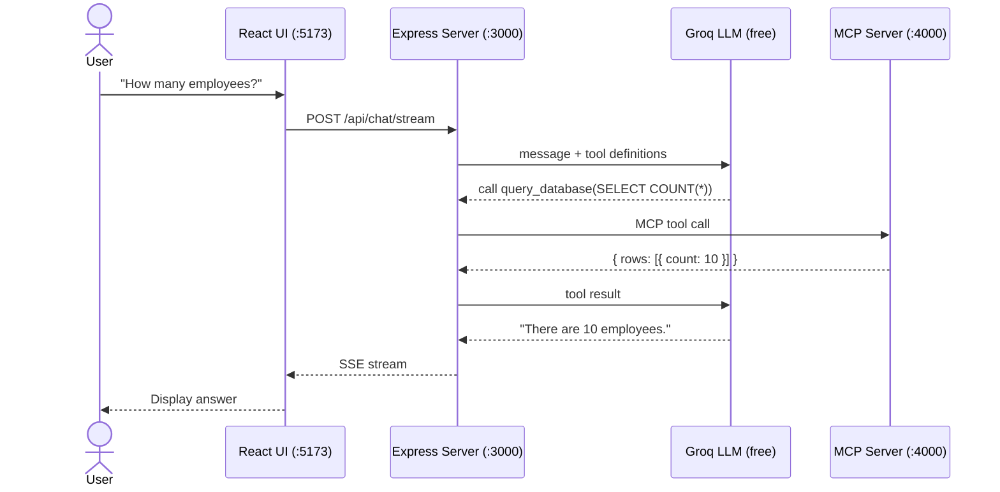
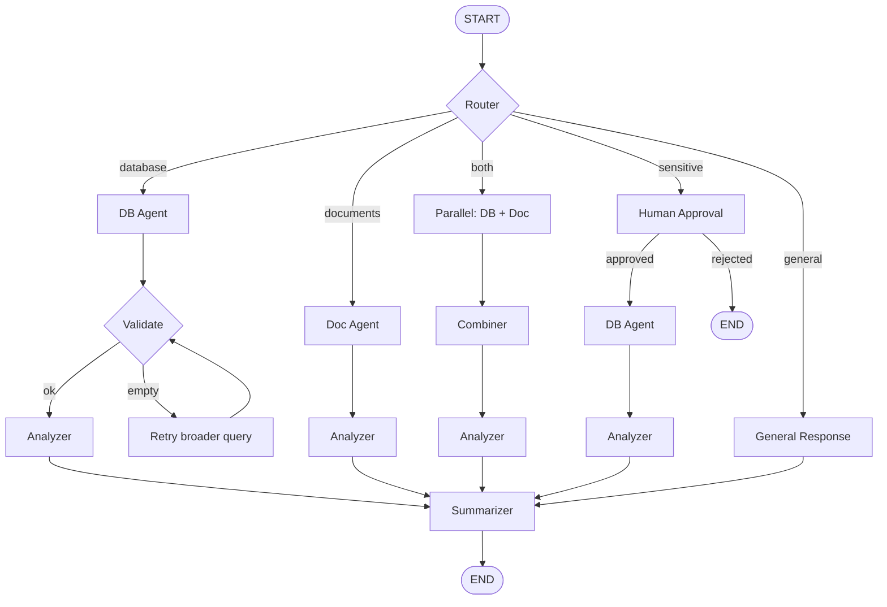

# MCPilot

MCPilot is an open-source AI assistant starter kit built on **MCP (Model Context Protocol)** with support for **LangGraph** orchestration.

It connects a React chat UI to an Express-based AI agent that talks to a standalone MCP server. The agent decides which tools to call (database queries, document search), executes them via MCP, and streams the answer back in real time. Everything runs locally and costs nothing -- the LLM calls go through Groq's free API tier.

## Use Cases

- **Internal company chatbot** -- Let employees ask questions about HR policies, org structure, product catalog, or order data using natural language
- **MCP reference implementation** -- Learn how to build a production-style MCP server and connect it to an AI agent, Cursor, or Claude Desktop
- **LangGraph starter project** -- A working example of routing, parallel tool execution, retries, and human-in-the-loop approval using LangGraph
- **AI agent prototyping** -- Swap in your own database, documents, or API tools and have a working agent chat in minutes
- **Teaching / workshops** -- Two agent modes (simple loop vs LangGraph) make it easy to teach AI agent concepts step by step

## Highlights

- **LangGraph orchestration** -- Router, validator, parallel execution, human-in-the-loop approval, retry logic, all wired as a state machine
- **Simple agent mode** -- A minimal tool-calling loop for quick prototyping
- **MCP-native** -- The data layer is a standalone MCP server; plug it into Cursor, Claude Desktop, or any MCP client
- **Streaming** -- Real-time token streaming via Server-Sent Events (SSE)
- **Human-in-the-loop** -- Sensitive queries (e.g. salary lookups) pause for user approval before executing
- **Zero cost to run** -- Uses Groq's free API tier, SQLite for data, no external infra needed

## Architecture



### How a question flows



### LangGraph Agent Flow



## Agent Modes

### Simple Agent (default)

A straightforward tool-calling loop: send message to LLM, if it requests a tool call execute it via MCP, feed the result back, repeat until the LLM returns a final answer (max 10 iterations). Good for understanding the basics before diving into LangGraph.

### LangGraph Agent

A state-machine agent with intelligent routing:

- **Router** -- LLM classifies the question into database / documents / both / sensitive / general
- **DB Agent** -- Generates and runs SQL queries via MCP
- **Doc Agent** -- Searches internal markdown documents via MCP
- **Parallel execution** -- "Both" queries run DB + Doc agents simultaneously, then combine results
- **Validator + Fallback** -- If a DB query returns empty, retries with a broader query (max 2 retries)
- **Human Approval** -- Sensitive queries pause and wait for user to approve/reject
- **Analyzer** -- LLM extracts insights from raw tool results
- **Summarizer** -- LLM creates the final user-friendly answer

Toggle between modes using the **Engine** button in the chat header.

## Monorepo Structure

```text
MCPilot/
├── frontend/      # Chat UI -- React + Vite
├── server/        # Agent API -- Express, OpenAI SDK, LangGraph
├── mcp-server/    # Standalone MCP server -- SQLite + document tools
└── package.json   # Root scripts (dev, seed, install:all)
```

## Tech Stack

| Layer | Technologies |
|-------|-------------|
| Frontend | React, Vite |
| Backend | Express, OpenAI SDK (pointed at Groq), LangGraph |
| MCP Server | `@modelcontextprotocol/sdk`, Express, `better-sqlite3` |
| LLM | Groq API (free tier) |
| Database | SQLite |
| Protocol | MCP over Streamable HTTP |
| Streaming | Server-Sent Events (SSE) |

## Quick Start

### Prerequisites

- **Node.js 18+**
- **Groq API key** (free) -- get one in 30 seconds:
  1. Go to [console.groq.com](https://console.groq.com)
  2. Sign up with Google/GitHub (no credit card needed)
  3. Navigate to **API Keys** and create a new key
  4. Copy the key -- you'll paste it in step 3 below

### 1) Install dependencies

```bash
npm run install:all
```

### 2) Seed demo data

```bash
npm run seed
```

This creates a SQLite database with sample data (employees, products, orders) and markdown documents (leave policy, onboarding guide, expense policy).

### 3) Configure environment

Create or update `server/.env`:

```env
GROQ_API_KEY=your_key_here
LLM_MODEL=moonshotai/kimi-k2-instruct-0905
PORT=3000
MCP_SERVER_URL=http://localhost:4000/mcp
```

### 4) Run everything

```bash
npm run dev
```

This starts all three services in parallel:

| Service | URL |
|---------|-----|
| Frontend | `http://localhost:5173` |
| API Server | `http://localhost:3000` |
| MCP Server | `http://localhost:4000` |

Open `http://localhost:5173` in your browser and start chatting.

## Useful Commands

```bash
npm run dev            # Start all three services
npm run dev:mcp        # MCP server only
npm run dev:server     # API server only
npm run dev:frontend   # Frontend only
npm run seed           # Recreate sample DB + docs
```

## API Endpoints

| Method | Path | Description |
|--------|------|-------------|
| POST | `/api/chat/stream` | Simple agent (SSE streaming) |
| POST | `/api/chat` | Simple agent (JSON response) |
| POST | `/api/chat/langgraph` | LangGraph agent (SSE streaming) |
| POST | `/api/chat/langgraph/resume` | Resume after human approval |

## MCP Tools

The MCP server exposes 5 tools that any MCP client can call:

| Tool | Description |
|------|-------------|
| `query_database` | Run read-only SQL (`SELECT`) queries against the company database |
| `list_tables` | List all tables and their columns |
| `search_documents` | Search internal docs by keyword |
| `get_document` | Fetch a specific document by name |
| `list_documents` | List all available documents |

## Use the MCP Server with Cursor / Claude Desktop

The MCP server is standalone and standard-compliant. You can connect it to any MCP client independently.

### Cursor (HTTP -- server must be running)

Add to `.cursor/mcp.json`:

```json
{
  "mcpServers": {
    "mcpilot-data": {
      "url": "http://localhost:4000/mcp"
    }
  }
}
```

### Cursor / Claude Desktop (stdio -- auto-launched)

```json
{
  "mcpServers": {
    "mcpilot-data": {
      "command": "node",
      "args": ["/absolute/path/to/mcp-server/src/index.js", "--stdio"]
    }
  }
}
```

## Example Questions

| Question | What happens |
|----------|-------------|
| "How many employees are there?" | DB Agent runs a SQL count query |
| "What is the leave policy?" | Doc Agent searches markdown documents |
| "Compare engineering salaries with expense policy" | Parallel: DB + Doc agents run simultaneously |
| "What is Priya's salary?" | Human approval required before executing |
| "Hello!" | General response, no tools needed |

## Contributing

Contributions are welcome.

1. Fork the repo
2. Create a feature branch
3. Open a pull request

## License

MIT
